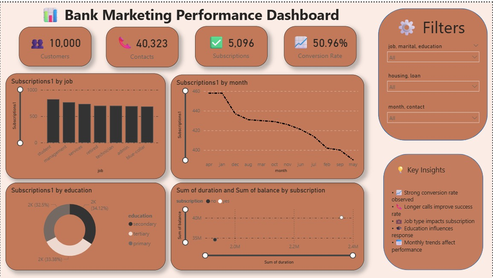

👇

📊 Bank Marketing Performance Dashboard

This project is part of Task 3 – Future Interns Internship Program, where I built an interactive dashboard to analyze bank marketing campaign performance and customer behavior.

📌 Problem Statement

The objective of this project is to analyze marketing campaign data of a bank and identify key factors that influence customer subscription to term deposits. The dashboard helps in understanding trends, customer segments, and campaign effectiveness.

🚀 Features
KPI Cards for:

Total Customers

Total Contacts

Subscriptions

Conversion Rate

Interactive filters for better analysis

Visual insights based on:

Job roles

Education level

Monthly trends

Correlation between campaign duration and balance

💡 Key Insights

Strong overall conversion rate observed

Certain job categories contribute more to subscriptions

Monthly trends show variation in campaign performance

Education level impacts customer decisions

Longer interaction duration increases chances of subscription

🛠️ Tools & Technologies

Power BI

Data Cleaning & Transformation

Data Visualization

📚 Learnings

Building interactive dashboards

Designing user-friendly layouts

Extracting actionable insights from data

Importance of data storytelling

📷 Dashboard Preview

🔗 Acknowledgment

Thanks to Future Interns Internship Program for providing this opportunity to enhance my data analytics skills.

